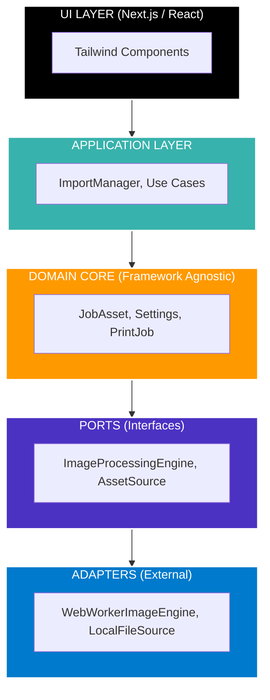

  
  <h1>CyberCafe Print Studio ???</h1>
  
<strong>An Enterprise-Grade, Offline-First Browser Operating System for Document and Image Production</strong>

  

    
    
    
    
    
  

 

## ?? Project Overview

| Metric | Details |
| :--- | :--- |
| **Project Name** | CyberCafe Print Studio |
| **Live Project Link** | [**https://printing-software.vercel.app**](https://printing-software.vercel.app) |
| **Lead Developer** | [**Kasim Shah**](https://github.com/kasimshah19) |
| **Core Concept** | Replacing desktop print-shop software with a unified, browser-native operating system. |
| **Architecture Standard** | Hexagonal Architecture (Ports and Adapters) & Domain-Driven Design (DDD). |
| **Deployment Model** | Capability-Aware Edge Deployments (Vercel) & Local Intranet Node Servers. |
| **Performance Standard** | 60 FPS UI via Threaded Web-Workers (OffscreenCanvas). |

---

## ?? The Industry Problem: A Fragmented Nightmare

If you walk into a printing hub, cybercafe, or government document kiosk today, you will witness a chaotic workflow that hasn't evolved since 2010. To cater to a single customer who needs a passport photo and an Aadhaar (ID) card printed, an operator typically executes the following fragmented pipeline:

1. **Dangerous File Transfer:** The customer is asked to send their highly confidential documents via WhatsApp Web or by plugging in a virus-prone USB drive.
2. **Context Switching:** The operator opens Adobe Photoshop to manually crop the passport photo. Then they open MS Word to drag-and-drop the photo onto an A4 page. Then they switch to a buggy, ad-riddled PDF website to compress the customer's secondary document.
3. **UI Thread Freezing:** Because web applications perform heavy mathematical rasterizations (e.g., resizing high-res scans) on the main JavaScript thread, the system frequently hangs.
4. **Internet Dependency:** When the ISP drops connection, the entire operation halts because none of modern web-apps utilize local browser cache effectively.

---

## ?? The Architectural Solution

**CyberCafe Print Studio** is engineered from the ground up to completely replace that legacy fragmented pipeline. It is an end-to-end OS that runs entirely inside the browser locally.

### ? Revolutionary Technical Capabilities

- **Local P2P File Connectivity:** Generates a secure, dynamic QR code connected to the shop's local IP address. Customers scan the QR and directly drop files from their mobile browser into the shop PC's IndexedDB memory store—bypassing the cloud entirely.
- **Multithreaded Web-Worker Image Engines:** Operations like rotations, formatting, and perspective math are dispatched to Background JavaScript Threads utilizing OffscreenCanvas. The front-end React DOM is completely decoupled from rendering math.
- **Robust Offline-First Data Persistence:** By overriding volatile RAM and localStorage, the core relies on the IndexedDB API mapped through an aggressive Repository Pattern. Validations and schema saving happen offline.
- **Stateless Capability UI & Graceful Degradation:** When deployed to edge serverless networks (e.g., Vercel) instead of local Intranet machines, the code auto-detects execution contexts. Instead of throwing 500 socket errors for P2P transfers, it intelligently degrades the UI, rendering "Local PC required" tags (Capability-Aware UI).

---

## ??? Deep Dive: Hexagonal (Clean) Architecture

To build a framework that can scale across decades and adapt to changing AI libraries, this project rigorously enforces **Domain-Driven Design (DDD)** and the **Ports and Adapters (Hexagonal)** Pattern. 

React is treated purely as an independent UI detail, not the core app logic.

### Module Boundary Graph

> **Why this matters to enterprise engineering:** 
> Today, we use `WebWorkerImageEngine` for image manipulation. Tomorrow, if we want to integrate an advanced C++ WebAssembly module for OpenCV-based edge detection, we simply write a new Adapter matching the `ImageProcessingEngine` Port. We do not have to touch a single line of React code or Application logic to perform this massive core upgrade.

---

## ?? Engineering Implementation: Module Breakdowns

### 1. ?? Connectivity Center (Data Ingestion)
- **Engine Pipeline:** The `AssetSource` Port unifies data ingestion. Whether files come from `LocalQRTransferAdapter` (Phone scanning) or `FS-HotFolderAdapter` (Local desktop folder sync via `showDirectoryPicker`), they are funneled through the `ImportManager` exactly the same way.
- **Outcome:** Predictable, universal File normalization before passing it to the database.

### 2. ?? Photo Studio (Automated Processing Engine)
- **Engine Pipeline:** Implements `BrowserPhotoEngine` adhering to the `PhotoProcessingEngine` port. 
- **Outcome:** Hard-codes Passport ratios mathematically (35x45mm std) and automatically invokes the non-blocking background `WebWorker` to perform heavy aspect-ratio crops, leaving the DOM highly responsive.

### 3. ?? ID Card Studio (Perspective & Compositing)
- **Engine Pipeline:** Implements `BrowserIDCardEngine` implementing the `IDCardProcessingEngine` port.
- **Outcome:** Designed exclusively for PVC ID cards (Aadhaar, Voter, Driving License). Simultaneously buffers Front and Back scans, preparing them mathematically to map onto CR80 PVC dimensions (85.6mm x 54mm) seamlessly.

### 4. ?? Document Studio (OCR & Rasterization)
- **Engine Pipeline:** Features decoupled `BrowserPDFEngine` and `BrowserOCREngine` adapters.
- **Outcome:** Pre-configured to mock heavy PDF splitting and Optical Character Recognition (OCR), designed to natively host Tesseract or PDF-Lib binaries in the background.

---

## ?? Comprehensive Technology Stack

| Capability / Layer | Technology Chosen | Justification for Selection |
| :--- | :--- | :--- |
| **Framework** | Next.js 14, React 18 | Client/Server explicit boundaries let us control precisely what renders aggressively vs what is delayed. Fast App Router layout trees. |
| **Language** | TypeScript (Strict Mode) | Deep interface nesting and polymorphic data pipelines require 100% strict type safety to prevent runtime reference crashes. |
| **UI Design System** | Tailwind CSS + Lucide Icons | Utility-first architecture allowing lightning-fast iterations without managing thousands of CSS cascading scopes. |
| **Storage Context** | IndexedDB via Custom Repositories | Replaces fragile `localStorage` limits (5MB) with robust NoSQL Object Store capable of holding thousands of high-res Blobs natively. |
| **Memory Sync** | React `useRef` + Object URLs | Standard state hooks cause re-renders. By offloading File Blobs globally and linking them via \URL.revokeObjectURL\, we dodge React memory leak bottlenecks. |

---

## ?? Getting Started (Execution Environments)

### A. The Stateless Live Preview (Cloud Context)
You can view the aesthetic fidelity and standard browser components via the Next.js Vercel deployment:
?? **[Live Project Link](https://printing-software.vercel.app)**
*(**Note:** Network-specific functionality like local P2P Phone-Upload socket bindings are intentionally disabled by the app's capability-detector engine to respect serverless boundary limitations).*

### B. Full Enterprise Execution (Intranet Context)
To unleash the actual power of localized multithreading and machine P2P connectivity, run the operating system locally:

`ash
# 1. Clone this enterprise repository
git clone https://github.com/kasimshah19/Printing-Software.git

# 2. Extract into the directory
cd Printing-Software

# 3. Pull required Node modules
npm install

# 4. Boot the internal Webpack/Turbopack node server
npm run dev

# 5. Access the OS Pipeline via your browser
# Navigation: http://localhost:3000
`

---

  <h3>Architected and Driven by Code Quality   <a href="https://github.com/kasimshah19">Kasim Shah</a></h3>
  
<i>Ready for Enterprise Production Architecture</i>

